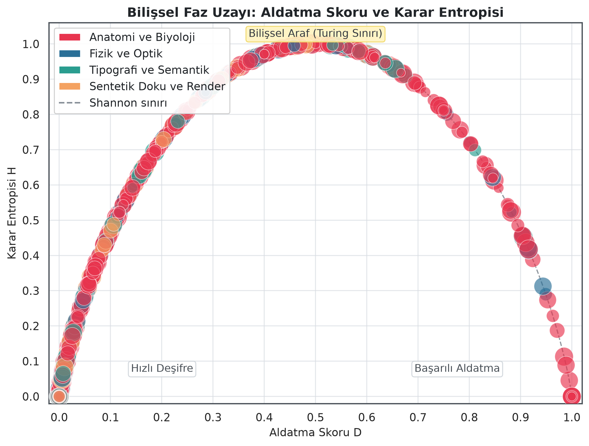
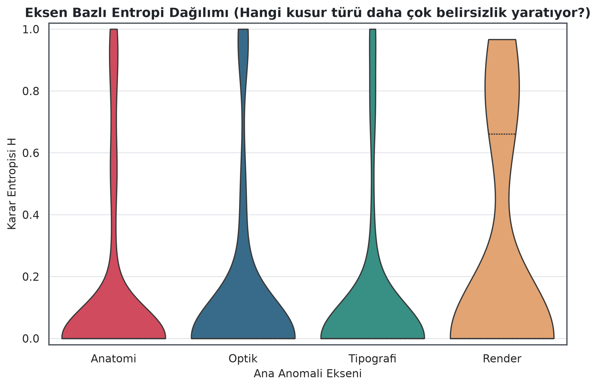
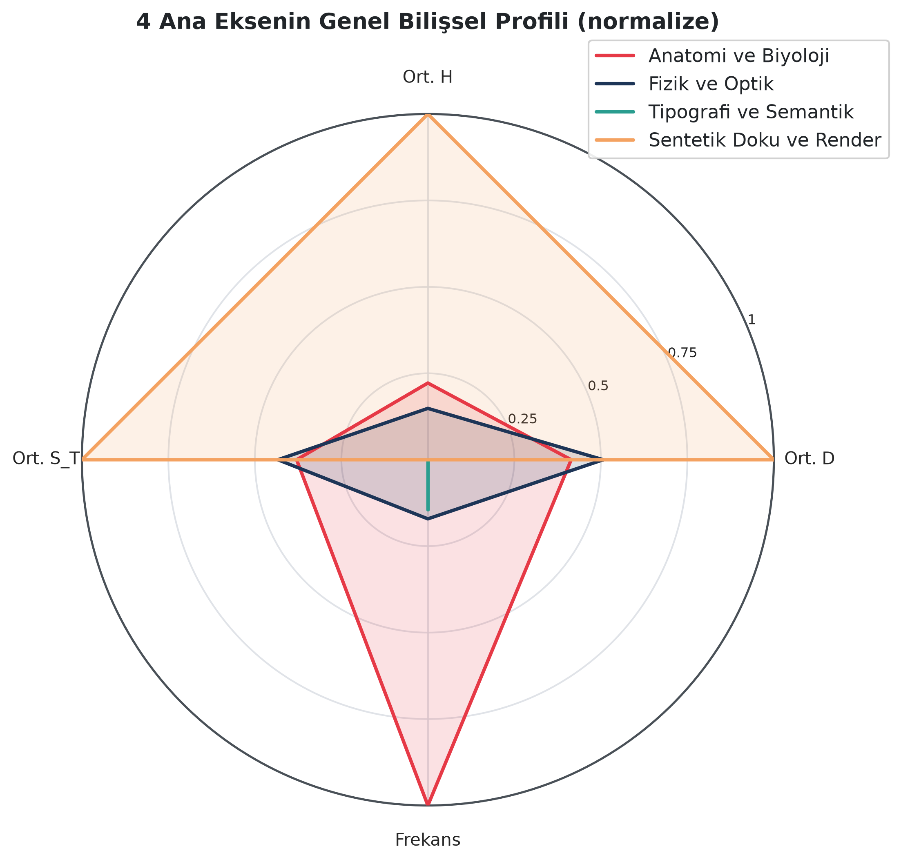
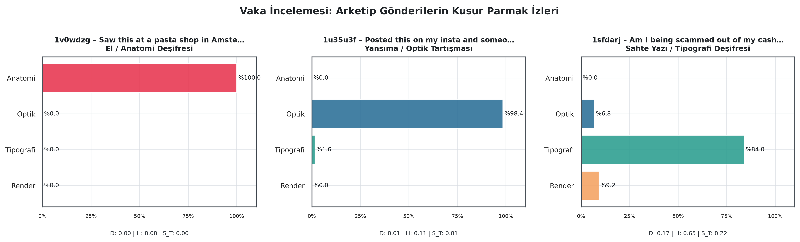

# Cognitive Friction: Modeling Human Decision Entropy in Synthetic Media Forensics

> **The Feynman Intuition:**  
> Traditional forensic models attempt to force rigid mathematical boundaries onto organic human observation. We invert this premise: instead of letting formal logic dictate how psychology, biology, and philosophy should behave, we let human evolutionary biology, perceptual psychology, and cognitive friction guide the mathematics.

A forensic and cognitive modeling framework that departs from the standard binary ("Real vs. Fake") classification paradigm. This framework models how human crowds collectively perceive, debate, and resolve synthetic visual anomalies using **Information Theory (Shannon Entropy)** and **Self-Supervised Vision Backbones (DINOv2)**.

---

## 📌 Theoretical Framework

Modern generative models (Midjourney v6, SD3, Flux) increasingly bypass standard pixel-frequency detectors by minimizing local generation artifacts. Human perception, however, does not evaluate images through a homogeneous scan:
* **Reflexive Decoupling:** Anomalies violating core evolutionary expectations (e.g., biological anatomy, hand digits, structural facial asymmetry) trigger near-instantaneous consensus with near-zero epistemic friction.
* **Cognitive Limbo (Turing Horizon):** Physical ambiguities (e.g., subtle optical reflections, depth-of-field anomalies) and diffusion surface textures trigger intense community debate, leading to high decision entropy.

By mining 1,000+ images and ~18,000 human deliberations from [r/isthisAI](https://www.reddit.com/r/isthisAI) via NLP clustering (`MiniLM + UMAP + HDBSCAN + c-TF-IDF`), this pipeline projects crowd perception into 4 anomaly axes and estimates latent cognitive friction directly from pixel embeddings.

---

## 📐 Mathematical Metrology

For each artifact, community signals are weighted by upvote authority and an evidence multiplier ($\gamma = 1.5$):

1. **Deception Score ($D \in [0, 1]$):** The proportion of collective weight convinced of the image's authenticity:
   $$D = \frac{W_{\text{real}}}{W_{\text{real}} + W_{\text{ai}}}$$
   - $D \to 0.0$: Rapid Crowd Debunking (Unanimous AI).
   - $D \to 1.0$: Complete Crowd Deception (Unanimous Human/Real).

2. **Decision Entropy ($H \in [0, 1]$):** The degree of cognitive friction and ideological polarization across observers:
   $$H = -\left[ D \log_2 D + (1 - D) \log_2 (1 - D) \right]$$
   - $H = 0.0$: Total Consensus (Zero Friction).
   - $H = 1.0$: Maximum Epistemic Limbo ($D = 0.50$, Critical Turing Boundary).

3. **Composite Turing Endurance Index ($S_T$):** Evaluates an artifact's capacity to deceive while maintaining active deliberation:
   $$S_T = D \cdot (1 + 0.5 \cdot H)$$

4. **Sparsity Guard:** A strict observation threshold ($\text{support} \ge 2$) ensures unobserved visual dimensions default to `null`, preventing synthetic artifact hallucination.

---

## 🔬 Four Anomaly Dimensions

* **Anatomy & Biology:** Digits, limbs, facial structure, dentition, and organic textures.
* **Physics & Optics:** Mirror reflections, directional light/shadow coherence, focal planes.
* **Typography & Semantics:** Illegible glyphs, font deformities, synthetic environmental text.
* **Synthetic Texture & Render:** Plastic diffusion sheen, color banding, high-frequency render noise.

---

## 📊 Empirical Findings & Phase Space

| Cognitive Phase Space ($D$ vs $H$) | Anomaly Entropy Distribution |
|:---:|:---:|
|  |  |
| *Alignment between empirical crowd decisions and the theoretical Shannon limit.* | *Anatomy triggers immediate consensus ($H \approx 0$), while Render triggers cognitive paralysis ($H \approx 0.7-1.0$).* |

| Axis Cognitive Profile Radar | Case Analysis: Anomaly Fingerprints |
|:---:|:---:|
|  |  |
| *Anatomy (high frequency, zero entropy) vs. Render (low frequency, peak entropy) paradox.* | *The "Smoking Gun" principle: a single critical flaw dominates overall authenticity.* |

---

## 🧠 Multi-Task Vision Architecture (Phase 3)

The multi-task model (`CognitiveGatingModel`) leverages a frozen **DINOv2 (`dinov2_vits14`)** backbone, passing extracted 384-dimensional `[CLS]` embeddings through a shared neck and two specialized heads:

```text
[Input Image] ──> [Frozen DINOv2] ──> [LayerNorm + GELU + Dropout] ──┬──> [Fingerprint Head (Softmax)] ──> 4D Anomaly Fingerprint
                                                                     └──> [Deception Head (Sigmoid)]   ──> Predicted D Score
```

* **Fingerprint Head Performance:** Achieves **0.715 Cosine Similarity** and **63.4% Argmax Accuracy** against a 25% random baseline, successfully predicting crowd discourse focus purely from pixel representations.
* **Architectural Insight:** Scalar $D$ regression exhibits mean collapse under global 224×224 `[CLS]` pooling, as isolated local defects (e.g., an extra digit) are diluted within global scene features. This necessitates our subsequent foveated **Coarse-to-Fine (ROI)** extraction module.

---

## 🚀 Quickstart

```bash
git clone <repo-url>
cd aiornot-project

python -m venv .venv
# Windows (PowerShell):
.venv\Scripts\activate
# Linux/macOS:
source .venv/bin/activate

pip install -r requirements.txt
```

### Run End-to-End Pipeline

```bash
# Executes scoring, figure generation, DINOv2 embedding, and multi-task head training
python run_pipeline.py --skip-download
```

| Step | Task | Module | Output |
|:---:|---|---|---|
| 1 | Scoring Engine ($D, H, S_T$) | `src/scorer.py` | `data/processed/scored_posts.jsonl` |
| 2 | Image Downloader (Optional) | `src/download_images.py` | `data/raw/images/{post_id}.jpg` |
| 3 | Forensic Visualizations | `src/visualize.py` | `reports/figures/*.png` |
| 4 | DINOv2 Embedding Extraction | `src/extract_embeddings.py` | `data/processed/image_embeddings.pt` |
| 5 | Gating Head Training | `src/train.py` | `models/cognitive_gating_head.pt` |

**Execution Flags:**
* `python run_pipeline.py`: Full workflow including image downloads.
* `python run_pipeline.py --skip-download`: Bypasses download using local disk images.
* `python run_pipeline.py --skip-embed`: Skips feature extraction if `image_embeddings.pt` exists.

---

## 🛠️ Data Mining Architecture

To navigate platform limits without official API application overhead, an authenticated `httpx` pipeline incorporates **Browser Cookie Injection** to bypass anti-bot and Cloudflare WAF checks (HTTP 403).

```text
Listing Endpoint  : GET [https://www.reddit.com/r/isthisAI/](https://www.reddit.com/r/isthisAI/){hot|new|top}.json?limit=N
Comment Endpoint  : GET [https://www.reddit.com/r/isthisAI/comments/](https://www.reddit.com/r/isthisAI/comments/){post_id}.json
```

* **Dynamic WAF Bypass:** Session authentication using `.env` cookie injection (`REDDIT_COOKIE`).
* **Idempotent Combining (`--combine`):** Merges `hot`, `new`, and multi-tier `top` feeds to bypass Reddit's ~1,000-item pagination barrier, deduplicating across historical runs.

---

## 📂 Repository Structure

```text
aiornot-project/
├── data/
│   ├── raw/                 # Raw JSON-L crawls and images/ storage
│   └── processed/           # Scored datasets and image_embeddings.pt
├── models/                  # Trained PyTorch weights (.pt)
├── reports/
│   ├── figures/             # High-resolution vector/raster figures
│   └── training_metrics.json# Model history and validation benchmarks
├── src/
│   ├── config.py            # Dynamic root discovery and environment loading
│   ├── schema.py            # Pydantic schemas for data integrity
│   ├── scraper.py           # Authenticated Reddit scraper
│   ├── scorer.py            # Information-theoretic scoring engine
│   ├── visualize.py         # Publication-grade visualization suite
│   ├── extract_embeddings.py# DINOv2 feature extraction
│   ├── model.py             # Multi-task PyTorch architecture
│   └── train.py             # Early-stopping training engine
├── run_pipeline.py          # Unified execution coordinator
├── requirements.txt         # Cross-platform dependencies
└── README.md
```

---
---

# Bilişsel Sürtünme: Sentetik Medyada İnsan Karar Entropisinin Modellenmesi

> **Feynman Sezgisi:**  
> Klasik adli bilişim modelleri yapay matematiği organik insan algısına zorla dayatmaya çalışır. Biz bu denklemi tersine çeviriyoruz: Mantığımızın matematiğe insan psikolojisi, biyolojisi ve felsefesini dikte etmesi yerine; insan evrimsel biyolojisinin, algı psikolojisinin ve bilişsel sürtünmesinin matematiği yönlendirmesini sağlıyoruz.

Sentetik ve yapay zekâ üretimi görsellerin adli analizinde geleneksel ikili sınıflandırma (0/1 - Sahte/Gerçek) paradigmalarının ötesine geçen; insan topluluklarının görsel anomalileri nasıl algılayıp tartıştığını **bilgi teorisi (Shannon Entropisi)** ve **görme modelleri (DINOv2)** ile modelleyen açık kaynaklı araştırma ve çıkarım çerçevesi.

---

## 📌 Kuramsal Çerçeve

Modern difüzyon mimarileri (Midjourney v6, SD3, Flux) geliştikçe piksel frekans dedektörleri yetersiz kalmaktadır. İnsan beyni de sentetik görselleri homojen bir taramayla denetlemez:
* **Refleksif Deşifre:** Evrimsel beklentileri doğrudan ihlal eden anomaliler (el/parmak, diş, bariz biyolojik kusurlar) topluluk tarafından sıfır fikir ayrılığıyla, anında yakalanır.
* **Bilişsel Kriz (Turing Sınırı):** Fiziksel ve optik tutarsızlıklar ile difüzyon modellerinin pürüzsüz plastik dokuları kitle içinde yüksek epistemolojik sürtünmeye (karar entropisine) ve kutuplaşmaya yol açar.

Bu proje; [r/isthisAI](https://www.reddit.com/r/isthisAI) topluluğundaki 1.000+ görsel ve ~18.000 yorumu NLP madenciliği (`MiniLM + UMAP + HDBSCAN + c-TF-IDF`) ile 4 anomali eksenine ayırmakta, insan kanaatini matematiksel bir metrolojiye dönüştürmekte ve dondurulmuş bir **DINOv2** omurgası üzerinden piksellerden bilişsel kusur parmak izini tahmin etmektedir.

---

## 📐 Matematiksel Metroloji

Her görsel için topluluk tartışmaları, delil çarpanı ($\gamma = 1.5$) ve oy ağırlıkları üzerinden üç temel metrik hesaplanır:

1. **Aldatma Skoru ($D \in [0, 1]$):** Kitlenin görselin gerçekliğine ikna olma oranı:
   $$D = \frac{W_{\text{real}}}{W_{\text{real}} + W_{\text{ai}}}$$
   - $D \to 0.0$: Hızlı Deşifre (Ezici Yapay Zekâ Konsensüsü).
   - $D \to 1.0$: Kusursuz Aldatma (Ezici Gerçek Konsensüsü).

2. **Karar Entropisi ($H \in [0, 1]$):** Fikir ayrılığını ve bilişsel sürtünmeyi ölçen ikili Shannon Entropisi:
   $$H = -\left[ D \log_2 D + (1 - D) \log_2 (1 - D) \right]$$
   - $H = 0.0$: Sürtünmesiz Mutabakat (Sıfır İkilem).
   - $H = 1.0$: Maksimum Bilişsel Araf ($D = 0.50$, Kritik Turing Sınırı).

3. **Bileşik Turing Dayanıklılık İndeksi ($S_T$):** Belirsizlik ve tartışma yaratabilme gücünü ödüllendiren katsayı:
   $$S_T = D \cdot (1 + 0.5 \cdot H)$$

4. **Seyreklik Eşiği (Sparsity Guard):** Bir boyutta en az 2 bağımsız yorumcu desteği ($\text{support} \ge 2$) yoksa o eksen `null` bırakılır; böylece görselde olmayan kusurların yapay olarak puanlanması engellenir.

---

## 🔬 4 Bilişsel Anomali Ekseni

* **Anatomi ve Biyoloji:** El, parmak, uzuv, yüz ve fauna anomalileri.
* **Fizik ve Optik:** Yansımalar, ışık/gölge tutarlılığı, alan derinliği kusurları.
* **Tipografi ve Semantik:** Karakter bozulmaları, anlamsız glifler, sahte tabelalar.
* **Sentetik Doku ve Render:** Plastik doku hissi, difüzyon renk sapması, piksel artefaktları.

---

## 📊 Temel Bulgular ve Faz Analizleri

| Bilişsel Faz Uzayı ($D$ vs $H$) | Eksen Bazlı Entropi Dağılımı |
|:---:|:---:|
|  |  |
| *Shannon teorik sınırı ile pratik kitle kararlarının tam uyumu.* | *Anatomi kusurları refleksi tetiklerken ($H \approx 0$), Render kusurları arafta bırakır ($H \approx 0.7-1.0$).* |

| 4 Eksenin Bilişsel Profil Radarı | Vaka İncelemesi: Kusur Parmak İzleri |
|:---:|:---:|
|  |  |
| *Anatomi (yüksek frekans, düşük entropi) vs. Render (düşük frekans, tavan entropi) paradoksu.* | *Tekil bir hatanın (Smoking Gun) tüm inandırıcılığı tek başına çökerttiğini gösteren kanıt.* |

---

## 🧠 Faz 3: Çok Görevli Görme Mimarisi (Cognitive Gating)

Eğitilen model (`CognitiveGatingModel`), dondurulmuş bir **DINOv2 (`dinov2_vits14`)** görsel omurgasından çıkarılan 384 boyutlu `[CLS]` embedding vektörlerini girdi alarak iki eşzamanlı görev yürütür:

```text
[Görsel] ──> [DINOv2 (Dondurulmuş)] ──> [LayerNorm + GELU + Dropout] ──┬──> [Parmak İzi Kafası (Softmax)] ──> 4 Boyutlu Anomali Dağılımı
                                                                      └──> [Aldatma Kafası (Sigmoid)]   ──> Tahmini D Skoru
```

* **Parmak İzi Başarısı:** Rastgele %25 tabanına karşılık **0.715 Kosinüs Benzerliği** ve **%63.4 Argmax Doğruluğu**. Model, piksellerden sahnenin hangi anomali ekseninde tartışılacağını yüksek doğrulukla öngörür.
* **Mühendislik Çıkarımı:** Global 224×224 `[CLS]` token'ı küçük yerel kusurları (örn. tırnak bozulması) sahne kompozisyonu içinde erittiği için $D$ regresyonu bimodal dağılımda ortalamaya yönelir. Bu bulgu, insan gözünü taklit eden **Coarse-to-Fine (Bölgesel ROI Kırpma)** mimarisinin gerekliliğini ortaya koymuştur.

---

## 🚀 Hızlı Başlangıç (Quickstart)

```bash
git clone <repo-url>
cd aiornot-project

python -m venv .venv
# Windows (PowerShell):
.venv\Scripts\activate
# Linux/macOS:
source .venv/bin/activate

pip install -r requirements.txt
```

### Tek Komutla Uçtan Uca Boru Hattı

```bash
# Skorlama, görselleştirme, DINOv2 embedding ve model eğitimini sırayla çalıştırır
python run_pipeline.py --skip-download
```

| # | Adım | Modül | Çıktı |
|:---:|---|---|---|
| 1 | Puanlama Motoru ($D, H, S_T$) | `src/scorer.py` | `data/processed/scored_posts.jsonl` |
| 2 | Görsel İndirme (Opsiyonel) | `src/download_images.py` | `data/raw/images/{post_id}.jpg` |
| 3 | Yayın Kalitesinde Grafikler | `src/visualize.py` | `reports/figures/*.png` |
| 4 | DINOv2 Embedding Çıkarımı | `src/extract_embeddings.py` | `data/processed/image_embeddings.pt` |
| 5 | Gating Modeli Eğitimi | `src/train.py` | `models/cognitive_gating_head.pt` |

**Boru Hattı Parametreleri:**
* `python run_pipeline.py`: Görsel indirme dahil tam akış.
* `python run_pipeline.py --skip-download`: Disk üzerindeki hazır görsellerle devam eder.
* `python run_pipeline.py --skip-embed`: Tensörler önceden çıkarıldıysa adımı atlayıp doğrudan eğitime geçer.

---

## 🛠️ Veri Madenciliği ve Kazıyıcı Mimarisi

Reddit API kısıtlamalarını ve Cloudflare WAF engellerini (HTTP 403) aşmak için PRAW/OAuth yerine `httpx` üzerinden **Browser Cookie Injection** tekniği uygulanmıştır.

```text
Liste İstekleri  : GET [https://www.reddit.com/r/isthisAI/](https://www.reddit.com/r/isthisAI/){hot|new|top}.json?limit=N
Yorum İstekleri  : GET [https://www.reddit.com/r/isthisAI/comments/](https://www.reddit.com/r/isthisAI/comments/){post_id}.json
```

* **WAF Bypass:** `.env` üzerinden enjekte edilen gerçek tarayıcı çerezi (`REDDIT_COOKIE`) ve güncel `User-Agent`.
* **Kalıcı Tekilleştirme (`--combine`):** Reddit'in 1.000 gönderilik sayfalama sınırını aşmak için birden fazla sıralama türünü (`hot`, `new`, `top`) harmanlayarak tekilleştirilmiş JSON-L akışı üretir.

---

## 📂 Proje Dizin Yapısı

```text
aiornot-project/
├── data/
│   ├── raw/                 # Kazıma çıktıları (.jsonl) ve images/ klasörü
│   └── processed/           # Puanlanmış veriler ve image_embeddings.pt
├── models/                  # Eğitilmiş model ağırlıkları (.pt)
├── reports/
│   ├── figures/             # Üretilen yüksek çözünürlüklü grafikler
│   └── training_metrics.json# Model eğitim geçmişi ve doğrulama metrikleri
├── src/
│   ├── config.py            # Çevre değişkenleri ve dinamik kök yol yönetimi
│   ├── schema.py            # Pydantic veri modelleri
│   ├── scraper.py           # Cookie injection destekli kazıyıcı
│   ├── scorer.py            # Bilgi teorisi skorlama motoru
│   ├── visualize.py         # Analiz grafikleri modülü
│   ├── extract_embeddings.py# DINOv2 öznitelik çıkarıcı
│   ├── model.py             # Multi-task PyTorch mimarisi
│   └── train.py             # Erken durdurmalı eğitim hattı
├── run_pipeline.py          # Uçtan uca koordinasyon betiği
├── requirements.txt         # Platformdan bağımsız bağımlılıklar
└── README.md
```

---

## ⚖️ Lisans ve Etik

Bu proje akademik araştırma ve eğitim amaçlı geliştirilmiştir. Veri toplama ve işleme adımları kamuya açık içeriklerle sınırlı olup Reddit'in veri kullanım prensiplerine uygun olarak yürütülmektedir.